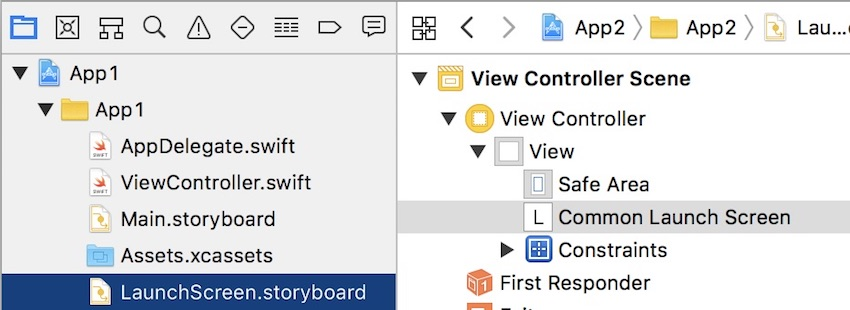

# Xcode can't deal with 1 common file for 2 projects in a workspace — shows the wrong Project.
-

### What does it actually mean?
When you select the common `LaunchScreen.storyboard` file, Xcode will always show it as part of `App2`, although it technically is also of `App1`, as said per the `project.pbxproj`.

### What am I doing here?

I'm using a common file, in this case the `LaunchScreen.storyboard`, that I moved outside of the `App1` Folder which was created when I first did the App. In the Finder it's a simple copy of `Base.lproj`, and then I kept `Main.storyboard` in the Project while deleting the other file.

As far as the `.xcodeproj` goes, you could probably delete the now red Storyboard, but I just edited it by using `project.pbxproj` in a Text Editor by using `../Base.lproj/LaunchScreen.storyboard` instead of `Base.lproj/LaunchScreen.storyboard`.

I then create a second App, similar, where I simply did the same editing of `project.pbxproj` and then removed the useless Storyboard in the Finder, since I refer to the files at the root of this git Repo, in `Base.lproj`.

### How to reproduce?

Open `CommonLaunchScreen.xcworkspace` and choose both `LaunchScreen.storyboard` files, you'll see how Xcode acts.